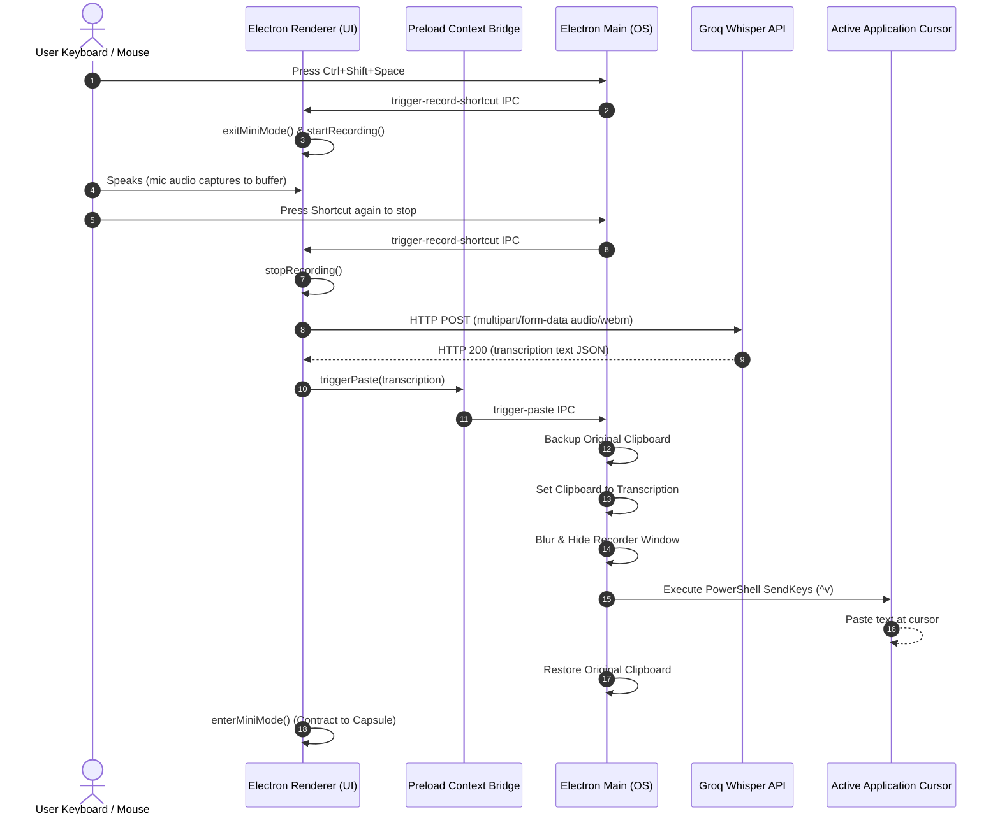

#  WhisperIsland

> **The missing Dynamic Island AI Dictation Capsule for Windows.** A premium, glassmorphic, floating speech-to-text utility powered by Groq & OpenAI Whisper. Just press a hotkey, speak, and watch your voice instantly type itself anywhere.

[](https://opensource.org/licenses/MIT)
[](http://makeapullrequest.com)
[](https://microsoft.com/windows)

---

## 📥 Standalone Download (No Setup Required!)

Don't want to deal with command lines, code, or installing Node.js? You can download the pre-compiled standalone application and run it instantly!

1. Go to the [**WhisperIsland Releases Page**](https://github.com/har412/whisper-island/releases/latest).
2. Download the `WhisperIsland-win32-x64.zip` file.
3. Extract the ZIP folder anywhere on your computer.
4. Double-click **`WhisperIsland.exe`** to start dictating instantly!
*(Optional: Right-click `WhisperIsland.exe` ➡️ "Send to" ➡️ "Desktop" to create a desktop shortcut).*

---

## ⚡ The Problem & The Solution

On macOS, users have access to gorgeous, minimalist dictation tools like *Superwhisper* or *MacWhisper*. On Windows, the options have been clunky, slow, or invasive. 

**WhisperIsland** bridges this gap. It sits as a tiny, beautiful purple "Dynamic Island" capsule at the top center of your screen. It stays out of your way until you hover over it or press your keyboard shortcut. When triggered, it records your audio, uploads it to Groq's lightning-fast Whisper API, copies it, and **auto-pastes it directly into your active cursor location**—all while safely preserving your current clipboard history.

---

## ✨ Features

- 🛸 **Dynamic Island Layout**: A sleek, semi-transparent capsule that contracts into a tiny `110px` pulsing orb to save screen real estate and blooms smoothly into a full control bar on hover.
- 🎹 **Global Hotkey Hook**: Trigger recording globally with a quick keystroke (`Ctrl+Shift+Space` by default), completely independent of which application you are currently typing in.
- ⚡ **Sub-Second Groq Whisper STT**: Integrated directly with Groq Cloud's ultra-low latency Llama-powered Whisper API.
- 📋 **Smart Clipboard Shield**: Backs up your existing copied text, overwrites the clipboard with the transcription to paste it, and instantly restores your original clipboard history in less than 300ms.
- 🧠 **Smart Active Paste**: Emits native PowerShell SendKeys typing calls to paste text automatically at the active focus cursor on Windows.
- 🌊 **Siri-Style 3D Wave Visualizer**: Reacts in real-time to microphone decibel changes using Web Audio API analysis drawing on HTML5 Canvas.
- 🔔 **Zero-Asset Sound Synthesizer**: Pure JavaScript oscillator frequency sweeps (chime for start, triple sweep for success, descending saw sweep for error) that require no local media assets.
- 📌 **Always-on-Top Pin Lock**: Easily toggle the "Pin" icon to prevent auto-hiding if you are doing extensive dictation.
- ⚙️ **Integrated Configuration**: Configure your Groq Key, select custom audio devices, record new global shortcuts, and toggle settings directly inside an expanding slider panel.

---

## 📐 How it Works (Under the Hood)

WhisperIsland uses a secure, modern Electron multi-process architecture combined with native Windows shell scripting to interact directly with your OS:



---

## 🚀 Getting Started

### Prerequisites

- **Windows 10 or 11**
- **Node.js** (v16.0.0 or higher)
- **NPM** (installed with Node)
- **Groq API Key**: Create a free account and get an API key in 10 seconds at the [Groq Cloud Console](https://console.groq.com/keys).

### Installation

1. **Clone the repository:**
   ```bash
   git clone https://github.com/YOUR_USERNAME/whisper-island.git
   cd whisper-island
   ```

2. **Install development dependencies:**
   ```bash
   npm install
   ```

3. **Start the application:**
   ```bash
   npm start
   ```

4. **Add your Groq API Key**:
   - The bar will open at the top center.
   - Click the **Gear (Settings) Icon** to expand the configuration panel.
   - Paste your `gsk_...` key.
   - Select your preferred Microphone from the dropdown.
   - Click **Save Changes**. The capsule will smoothly slide shut, ready to work!

---

## 🎹 Usage

- **Toggle Recording**: Press `Ctrl+Shift+Space` (or hover over the capsule and click the microphone icon) to start recording. Press it again to stop.
- **Auto-Paste**: Place your cursor in any editor (VS Code, Notepad, Discord, browser inputs) and start recording. When transcription completes, the text will automatically type itself there!
- **Pin Always-on-Top**: Click the **Pin Icon** to keep the control bar expanded.
- **Configure**: Click the **Gear Icon** to adjust models, shortcuts, toggle sound cues, or change microphone devices.
- **Tray Mode**: Click the **Close (Cross) Icon** to minimize the capsule to your system tray. Double-click the tray icon to restore it!

---

## 🛠️ Technology Stack

- **Core**: Electron (v30+)
- **Frontend**: Pure Vanilla HTML5, CSS3, & Modern ES6 JavaScript (No bulky frameworks, zero dependencies!)
- **Audio Capture**: browser Web Audio API & MediaRecorder
- **Native OS Paste Interactivity**: Node `child_process` + Windows PowerShell Windows Forms SendKeys assembly

---

## 🤝 Contributing

Contributions are what make the open source community such an amazing place to learn, inspire, and create. Any contributions you make are **greatly appreciated**!

1. Fork the Project
2. Create your Feature Branch (`git checkout -b feature/AmazingFeature`)
3. Commit your Changes (`git commit -m 'Add some AmazingFeature'`)
4. Push to the Branch (`git push origin feature/AmazingFeature`)
5. Open a Pull Request

*Please read our [Contributing Guidelines](CONTRIBUTING.md) for details on code style, IPC safety conventions, and developer workflows.*

---

## 📄 License

Distributed under the **MIT License**. See `LICENSE` for more information.

---

*Created with 💜 by [Harkirat](https://github.com/har412).*
