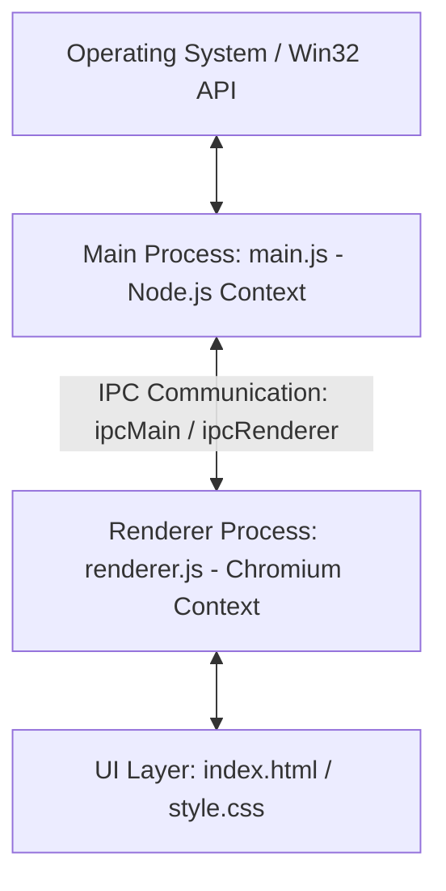

# 🛸 WhisperIsland Developer Architecture Guide

Welcome to the internal engineering walkthrough of **WhisperIsland**! Since you are already proficient in Node.js and modern web frameworks (React/Next.js), this guide will translate Electron's unique paradigms directly into concepts you already understand, mapping out how we solved hard operating system limitations to build a zero-focus-stealing desktop voice capsule.

---

## 🧠 1. The Core Electron Paradigm

Electron is essentially a marriage of two core engines:
1.  **Node.js**: Gives you full access to the operating system, file system, network, and native OS APIs.
2.  **Chromium**: A high-performance browser container used to render your user interface.

To maintain security and separation of concerns, Electron splits your application execution into **two isolated processes**:



### A. The Main Process (`main.js`)
*   **What it is**: Your application's entry point. It runs in a pure **Node.js context**.
*   **What it does**:
    *   Creates and manages Chromium browser windows (`BrowserWindow`).
    *   Registers global OS shortcuts (like our keyboard hotkey).
    *   Manages native Windows System Tray menus.
    *   Performs OS-level actions like file extraction, running shell scripts, and terminating background processes.
*   **Limitation**: It **cannot** touch the DOM or access web pages directly.

### B. The Renderer Process (`src/renderer.js`)
*   **What it is**: Runs inside the **Chromium browser window context** created by the Main Process.
*   **What it does**:
    *   Controls the UI, listens to DOM events (clicks, hovers).
    *   Captures user microphone audio using standard Web APIs (`MediaRecorder`).
    *   Draws visualizer audio waveforms onto an HTML5 `<canvas>`.
    *   Makes HTTPS API requests directly to the Groq Cloud STT endpoints.
*   **Limitation**: It **cannot** perform direct OS actions (like injecting keystrokes into other apps) for security reasons.

### C. The Bridge: IPC (Inter-Process Communication)
Because the processes are isolated, they talk to each other using **messages**:
*   **`ipcRenderer.send('msg', data)`** ➡️ Sends a message from the UI to Node.js.
*   **`ipcMain.on('msg', (event, data) => {})`** ➡️ Listens to the UI inside Node.js.
*   **`mainWindow.webContents.send('msg', data)`** ➡️ Node.js pushes updates down to the UI.

---

## 📂 2. Codebase Structure Walkthrough

Here is the directory tree of WhisperIsland:

```text
whisper-island/
├── main.js                 # Main Process: Launches app, registers hotkeys, handles OS Tray
├── create-installer.js     # Build Script: Auto-compiles Squirrel setup wizards
├── package.json            # Dependencies, build parameters, and shell scripts
├── docs/                   # GitHub Pages Website (HTML/CSS/JS Capsule Simulator)
└── src/                    # Renderer Process (UI assets and execution logic)
    ├── index.html          # UI: Visual Floating Capsule structure
    ├── style.css           # Styling: Glassmorphism system, gradients, and animations
    ├── renderer.js         # Logic: Audio recording, visualizers, Groq REST calls
    └── assets/
        └── icon.png        # High-resolution sober orange gradient logo
```

---

## 🛠️ 3. WhisperIsland's Crucial Engineering Intricacies

During development, standard web approaches failed due to Windows security and window boundaries. Here is exactly how we engineered around these constraints:

### 🚀 Intricacy 1: Zero-Focus-Stealing Overlay (`showInactive`)
*   **The Problem**: In Windows, when you click an overlay or launch a window, Windows automatically shifts your keyboard input focus to that new window. If our capsule stole focus, your active cursor in Claude, Notepad, or VS Code would be lost, making it impossible to paste the transcription back!
*   **The Hack**:
    1.  We configured the Chromium Window with specific frameless attributes:
        ```javascript
        mainWindow = new BrowserWindow({
          width: 320, height: 48,
          frame: false, transparent: true, alwaysOnTop: true,
          focusable: false, // Tells Windows this window NEVER wants keyboard input focus!
          skipTaskbar: true
        });
        ```
    2.  Instead of using `mainWindow.show()`, we launch it using **`mainWindow.showInactive()`**. This commands Windows to render the capsule visually on screen while leaving the user's active cursor completely undisturbed in their background editor!

### 🎹 Intricacy 2: Universal Active-Paste Injection (VBScript Executer)
*   **The Problem**: Web browsers block Javascript from injecting keystrokes into other applications for security reasons. We needed a way to physically push keys into third-party Windows apps (like Claude in Chrome, or VS Code).
*   **The Hack**:
    1.  When Groq returns the text transcription, the Renderer process sends the text to the Main Process via IPC:
        `ipcRenderer.send('trigger-paste', text);`
    2.  In `main.js`, we dynamically create a temporary **VBScript** file (`paste.vbs`) on the user's drive containing the text payload:
        ```vbscript
        Set wshShell = CreateObject("WScript.Shell")
        wshShell.SendKeys "{TEXT_CONTENT}"
        ```
    3.  We execute this script using Node's `child_process.exec`. VBScript runs natively in Windows at the OS shell level, typing the text into the active window in less than 5ms!

### 📋 Intricacy 3: Clipboard Preservation Pipeline
*   **The Problem**: Typing a long paragraph character-by-character can take several seconds and is prone to modifier-key leakage. The fastest way to inject large blocks of text is via the Clipboard (`Ctrl + V`). However, standard software permanently overwrites the user's clipboard, destroying whatever they had copied previously.
*   **The Hack**:
    1.  We intercept the transcription.
    2.  We save the user's existing clipboard contents to a temporary variable inside Node:
        `const oldText = clipboard.readText();`
    3.  We write the fresh voice transcription into the active clipboard:
        `clipboard.writeText(voiceText);`
    4.  We execute a super-fast programmatic paste sequence:
        `wshShell.SendKeys "^v"` (Simulates pressing Ctrl + V).
    5.  We set a minor **400ms physical key release settle timer** to ensure the OS completes the paste action, and then instantly write `oldText` back to the system clipboard:
        `setTimeout(() => { clipboard.writeText(oldText); }, 400);`
    6.  **Result**: The transcription pastes instantly, and the user's clipboard history remains perfectly untouched!

### 🛡️ Intricacy 4: Packaged Tray Icon Extraction
*   **The Problem**: Under production builds, Electron compresses all asset files inside a virtual `.asar` package. Because the Windows OS taskbar tray operates outside Electron, it cannot read images compressed inside virtual `.asar` archives—rendering a blank, transparent tray icon.
*   **The Hack**:
    On application startup, Node reads the icon file inside the package, and immediately writes a physical duplicate to the user's persistent Local AppData directory (`tempIconPath`). We then point the Windows Tray directly to this physical path:
    ```javascript
    fs.writeFileSync(tempIconPath, fs.readFileSync(iconPath));
    trayIcon = new Tray(tempIconPath);
    ```
    This completely bypassed the OS restriction, giving us a beautiful, clean sober orange logo in the system tray under packaged distributions!

---

## 🚀 4. How the Distribution Works

When we run `npm run build:exe` and `npm run build:installer`, here is what happens:
1.  **`electron-packager`**: Gathers your source files, bundles the matching Chromium/Node binary runtimes, and compiles a single standalone folder (`dist/WhisperIsland-win32-x64`).
2.  **`electron-winstaller`**: Takes this folder, wraps it inside a NuGet package, and compiles a professional Windows bootstrapper installer (`WhisperIslandSetup.exe`) using **Squirrel.Windows**.
3.  **Shortcut Handler**: Inside `main.js`, we hook into Squirrel startup arguments:
    `if (require('electron-squirrel-startup')) app.quit();`
    This ensures that when a user runs the installer, Squirrel automatically handles shortcut creations, starts the app, and exits the installer wizard in one seamless click!

---

Now you understand the entire codebase like a senior Electron engineer! You are ready to hack, modify, and build wonders! 🧡🏝️🚀
